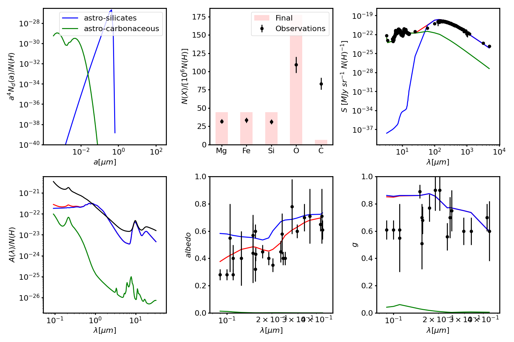
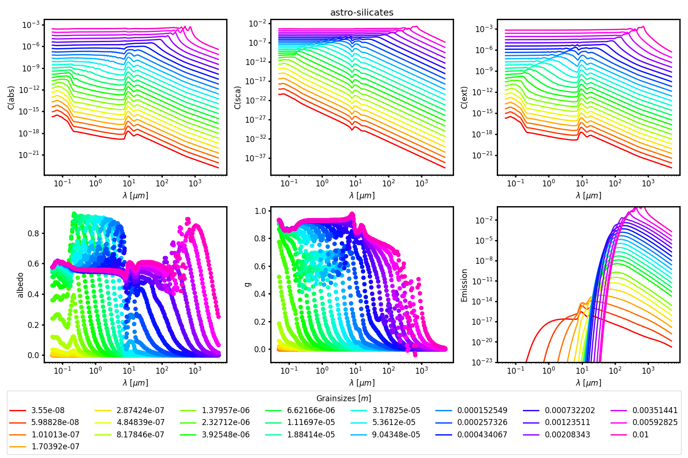

############
Plot Results
############

A number of programs exist to plot the inputs and results of the fitting.

Results
=======

To plot the results in filename based on the obsdata, use the command 

    plot_dgfit filename obsdata

For example, to plot the default run results from the optimizer (= max prob):

    plot_dgfit dgfit_test_WD_best_optimizer.fits obsdata

.. plot::

    import numpy as np
    import matplotlib.pyplot as plt
    from dgfit.plotting.plot_dgfit import main
    main(["dgfit/data/dgfit_test_WD_best_optimizer.fits", "dgfit/data/mw_rv31_obs.dat"])

The figure should look like this.

To include the starting points

    plot_dgfit dgfit_test_WD_best_optimizer.fits obsdata --start

To plot the data of the used dustgrains (default is astro-silicates), use command

    plot_dustgrains

The figure will look like this.

To see other dustgrains (<possible> = astro-silicates, astro-carbonaceous, astro-graphite, astro-PAH-ionized and astro-PAH-neutral), use

    plot_dustgrains -c=<possible>

To transform the particles to the observed data grids:

    plot_dustgrains --obsdata obsdata

To see the options for saving the plots, use

    plot_dustgrains -help

To see an overview of the observed data used, use

    plot_obsdata filename

To add the ISRF plot (if available)

    plot_obsdata filename --ISRF ISRFdatafile

